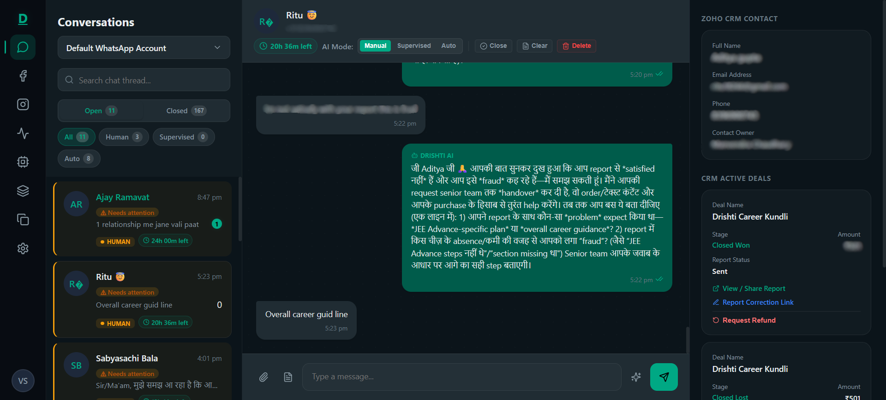
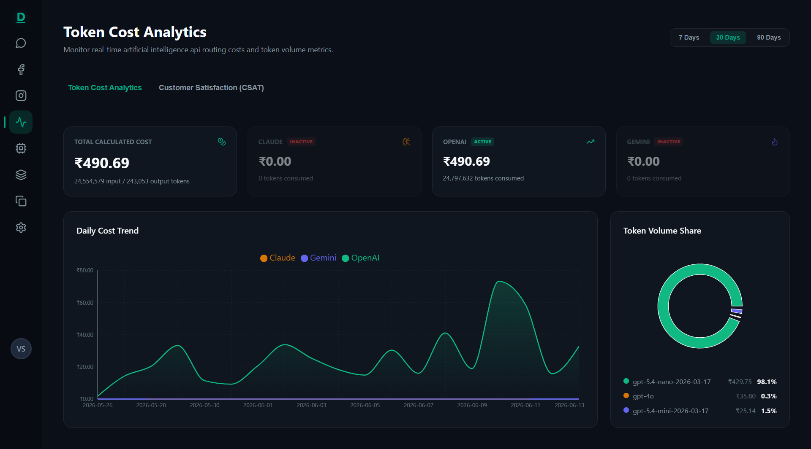
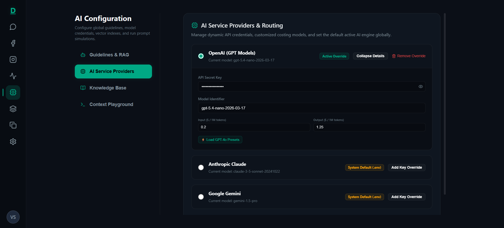
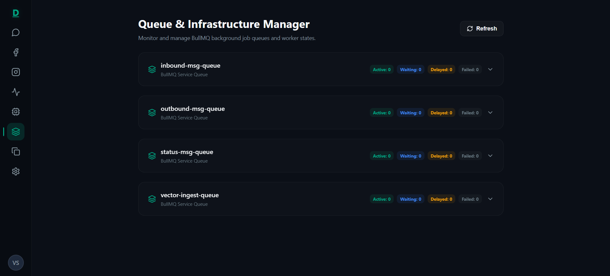

# Drishti Marketing OS — WhatsApp AI Customer Engagement Platform

> **Disclaimer**: This repository is a technical case study. The original implementation is proprietary and owned by the employer. No confidential source code, credentials, or sensitive business information is included.

---

## What Is This?

**Drishti Marketing OS** is a production-grade, AI-powered WhatsApp Business inbox built as a full replacement for legacy BSP subscriptions (WATI/AISensy). It connects directly to **Meta's WhatsApp Cloud API**, routes all inbound conversations through a multi-model AI pipeline (Claude 3.5, GPT-4o, Gemini 1.5 Pro), and enriches every chat with a live **Retrieval-Augmented Generation (RAG)** Knowledge Base and real-time **Zoho CRM/Books** context.

The result: median customer response time dropped from **4–12 hours → under 30 seconds**, with full 24/7 autonomous coverage.

---

## Measurable Outcomes

| Metric | Before | After |
|--------|--------|-------|
| Median response time | 4–12 hours | < 30 seconds |
| Support capacity | ~50 chats/day per agent | Unlimited automated |
| Platform subscription cost | Recurring per-agent BSP fees | Eliminated |
| AI accuracy confidence | N/A (no automation) | RAG-grounded responses |
| Delivery status visibility | None | Real-time (sent → delivered → read) |

---

## Key Features

| Category | Capability |
|----------|-----------|
| 🤖 **AI Auto-Responder** | Multi-provider switchboard (Claude, GPT-4o, Gemini 1.5 Pro) with automatic fallback chaining |
| 📚 **RAG Knowledge Base** | Self-hosted Qdrant vector store; 1536-dim embeddings via OpenAI; PDF/TXT ingestion pipeline |
| 💬 **Real-time Inbox** | WebSocket-synced shared inbox built on Next.js 16 + Socket.io |
| 🔀 **Dual AI Modes** | Autonomous (auto-send) or Supervised Draft (human-approve before send) |
| 🤝 **CRM Integration** | Read-only Zoho CRM & Books sidebar; live deal stages, invoice lookup, and secure report links |
| 🔒 **Security-First** | HMAC-SHA256 webhook verification, JWT + HttpOnly cookies, TOTP 2FA, ownership verification for private links |
| 📊 **Observability** | Token cost tracking per provider/model, BullMQ queue dashboard, structured JSON logging |
| 📣 **Broadcast Campaigns** | Template sync from Meta Graph API; bulk WhatsApp broadcasts via CSV or manual forms |
| 🧰 **AI Tool-Calling Agent** | Native function-calling loop; LLM invokes tools (CRM lookup, payment verify, KB search, refund request) |
| 🖼️ **Media Handling** | 16MB file uploads via EC2 local storage + Cloudflare R2 pre-signed PUT URLs |

---

## Architecture Overview

```
┌─────────────────────────────────────────────────────────────┐
│                   Meta WhatsApp Cloud API                   │
└──────────▲──────────────────────────────┬───────────────────┘
 Outbound  │                              │ Inbound Webhook
           │                              ▼
┌──────────────────────────────────────────────────────────────┐
│  DRISHTI MARKETING OS  (Turborepo Monorepo)                  │
│                                                              │
│  ┌─────────────────┐  WebSocket  ┌───────────────────────┐  │
│  │  Next.js 16     │◄───────────►│  Express API          │  │
│  │  Web Inbox      │    HTTP     │  (Bun Runtime)        │  │
│  └─────────────────┘             └──────────┬────────────┘  │
│                                             │               │
│                              ┌──────────────┼──────────┐    │
│                              ▼              ▼          ▼    │
│                          ┌───────┐    ┌─────────┐  ┌─────┐  │
│                          │MongoDB│    │ Qdrant  │  │Redis│  │
│                          └───────┘    │Vectors  │  │Queue│  │
│                                       └─────────┘  └─────┘  │
└─────────────────────────────────────────────────────────────┘
         │ LLM APIs                 │ Zoho India DC
         ▼                          ▼
  Claude / GPT-4o /           Zoho CRM + Books
  Gemini 1.5 Pro              (read-only)
```

---

## Tech Stack

### Backend
- **Runtime**: Bun (Node.js-compatible, fast startup)
- **Framework**: Express v5
- **Queue System**: BullMQ + Redis (4 dedicated queues)
- **Primary DB**: MongoDB with Mongoose ODM
- **Vector DB**: Qdrant (self-hosted, open-source)
- **AI SDKs**: OpenAI (`text-embedding-3-small`, GPT-4o), Anthropic (Claude 3.5 Sonnet), Google GenAI (Gemini 1.5 Pro)
- **Media**: Cloudflare R2 (S3-compatible) + EC2 local disk

### Frontend
- **Framework**: Next.js 16 (App Router, standalone mode)
- **State**: Zustand v5
- **Real-time**: Socket.io-client
- **Styling**: Vanilla CSS with custom design tokens (dark-mode, glassmorphism)
- **Charts**: Recharts SVG analytics

### Infrastructure
- **Deployment**: AWS EC2 (Dockerized), Nginx reverse proxy
- **CI/CD**: GitHub Actions → Amazon ECR → SSH deploy
- **Logging**: Winston → stdout (JSON) → CloudWatch-compatible
- **Config Validation**: Zod schema at boot

---

## Repository Structure

```
project-showcase/
├── README.md                     ← You are here
├── docs/
│   ├── architecture.md           ← System architecture + Mermaid diagrams
│   ├── system-design.md          ← Deep-dive system design decisions
│   ├── engineering-decisions.md  ← Key technical choices + rationale
│   ├── challenges-and-solutions.md ← Real engineering problems solved
│   ├── rag-pipeline.md           ← End-to-end RAG Ingestion & Query details
│   └── my-contributions.md       ← Specific engineering contributions
├── diagrams/                     ← Standalone Mermaid diagram sources
└── assets/                       ← Supporting visual assets
```

---

## Screenshots

> See [screenshots.md](screenshots.md) for the full gallery with captions.

| Inbox (WhatsApp + Zoho CRM) | Token Cost Analytics |
|---|---|
|  |  |

| AI Configuration — Providers | BullMQ Queue Monitor |
|---|---|
|  |  |

---

## Documentation Index

| Document | Description |
|----------|-------------|
| [Architecture](docs/architecture.md) | System components, data flows, and deployment topology |
| [System Design](docs/system-design.md) | Design tradeoffs, scalability, database schema, API design |
| [Engineering Decisions](docs/engineering-decisions.md) | Why Bun, Qdrant, BullMQ, and other key choices were made |
| [Challenges & Solutions](docs/challenges-and-solutions.md) | Hard problems solved in production |
| [RAG Ingestion & Query](docs/rag-pipeline.md) | Asynchronous indexing, sanitization, and context retrieval pipeline |
| [My Contributions](docs/my-contributions.md) | What I personally built and owned |

---

## Core Engineering Highlights

1. **Sub-2s Webhook Acknowledgement** — webhook controller enqueues to Redis instantly and returns `200 EVENT_RECEIVED` before Meta retries fire
2. **Idempotent Message Processing** — `metaWamid` unique index prevents duplicate saves from Meta webhook retries
3. **5-Part Grounded AI Context** — every AI response is assembled from brand prompt + RAG chunks + conversation history + Zoho CRM + user query
4. **Privacy Guard for Sensitive Links** — regex-extracted Deal IDs and emails are cross-verified against Zoho ownership before any private URL is injected into AI context
5. **Multi-Provider AI Fallback** — if one LLM provider fails, the switchboard retries with the next available model before triggering human takeover
6. **Dual Deployment Mode** — AI can run fully autonomous OR in supervised "draft approval" mode per conversation thread
7. **Zero-Downtime CI/CD** — GitHub Actions → ECR → SSH pulls only app images, never re-pulls third-party containers to avoid Docker Hub rate limits

---

*Built as a solo full-stack engineering project: architecture, backend, frontend, DevOps, AI integration, and system design.*
