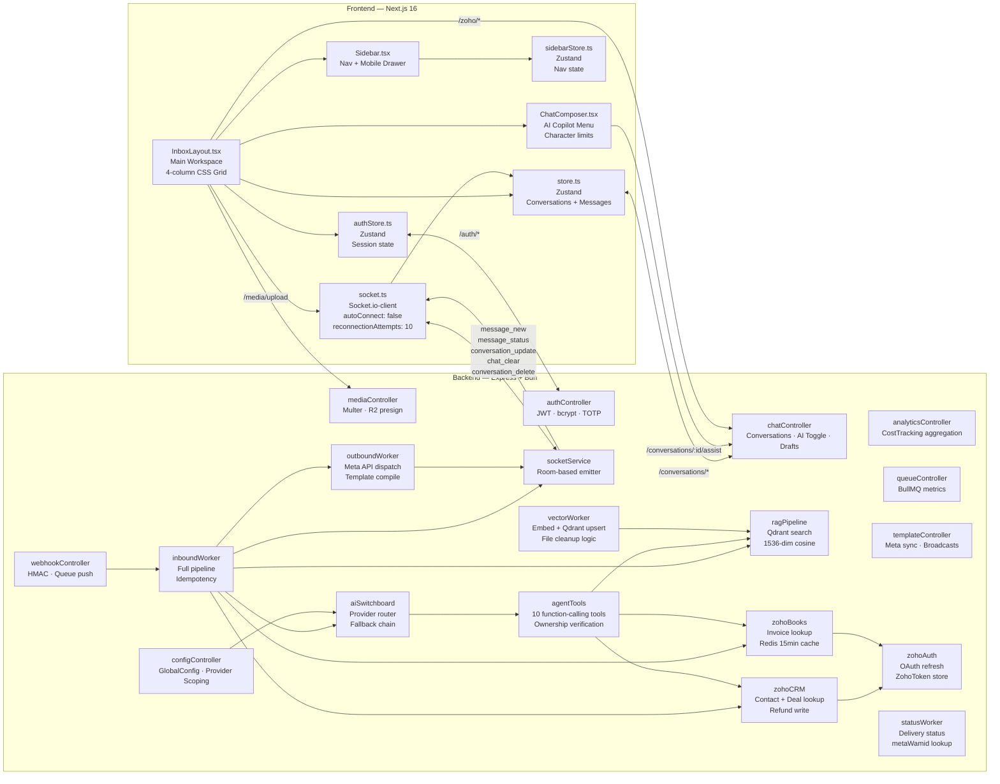

# Component Interactions Diagram

```mermaid
graph LR
    subgraph FE["Frontend — Next.js 16"]
        AUTH_STORE["authStore.ts\nZustand\nSession state"]
        INBOX_STORE["store.ts\nZustand\nConversations + Messages"]
        SIDEBAR_STORE["sidebarStore.ts\nZustand\nNav state"]
        SOCKET_CLIENT["socket.ts\nSocket.io-client\nautoConnect: false\nreconnectionAttempts: 10"]
        IL["InboxLayout.tsx\nMain Workspace\n4-column CSS Grid"]
        CC["ChatComposer.tsx\nAI Copilot Menu\nCharacter limits"]
        SIDEBAR_C["Sidebar.tsx\nNav + Mobile Drawer"]
    end

    subgraph BE["Backend — Express + Bun"]
        AUTH_C["authController\nJWT · bcrypt · TOTP"]
        CHAT_C["chatController\nConversations · AI Toggle · Drafts"]
        WEBHOOK_C["webhookController\nHMAC · Queue push"]
        CONFIG_C["configController\nGlobalConfig · Provider Scoping"]
        MEDIA_C["mediaController\nMulter · R2 presign"]
        ANALYTICS_C["analyticsController\nCostTracking aggregation"]
        QUEUE_C["queueController\nBullMQ metrics"]
        TMPL_C["templateController\nMeta sync · Broadcasts"]
        SOCK_S["socketService\nRoom-based emitter"]
        AI_SW["aiSwitchboard\nProvider router\nFallback chain"]
        RAG_P["ragPipeline\nQdrant search\n1536-dim cosine"]
        ZOHO_CRM["zohoCRM\nContact + Deal lookup\nRefund write"]
        ZOHO_BOOKS["zohoBooks\nInvoice lookup\nRedis 15min cache"]
        ZOHO_AUTH["zohoAuth\nOAuth refresh\nZohoToken store"]
        IW["inboundWorker\nFull pipeline\nIdempotency"]
        OW["outboundWorker\nMeta API dispatch\nTemplate compile"]
        VW["vectorWorker\nEmbed + Qdrant upsert\nFile cleanup logic"]
        SW["statusWorker\nDelivery status\nmetaWamid lookup"]
        AGENT_TOOLS["agentTools\n10 function-calling tools\nOwnership verification"]
    end

    %% Frontend internal
    IL --> AUTH_STORE & INBOX_STORE & SOCKET_CLIENT
    IL --> CC & SIDEBAR_C
    SIDEBAR_C --> SIDEBAR_STORE

    %% Frontend → Backend HTTP
    AUTH_STORE <-->|"/auth/*"| AUTH_C
    INBOX_STORE <-->|"/conversations/*"| CHAT_C
    CC -->|"/conversations/:id/assist"| CHAT_C
    IL -->|"/media/upload"| MEDIA_C
    IL -->|"/zoho/*"| CHAT_C

    %% Frontend → Backend WebSocket
    SOCKET_CLIENT <-->|"WebSocket"| SOCK_S

    %% Backend service graph
    WEBHOOK_C --> IW
    IW --> RAG_P & AI_SW & ZOHO_CRM & ZOHO_BOOKS & SOCK_S
    AI_SW --> AGENT_TOOLS
    AGENT_TOOLS --> ZOHO_CRM & ZOHO_BOOKS & RAG_P
    IW --> OW
    OW --> SOCK_S
    ZOHO_CRM & ZOHO_BOOKS --> ZOHO_AUTH
    CONFIG_C --> AI_SW
    VW --> RAG_P

    %% Emit events
    SOCK_S -->|"message_new\nmessage_status\nconversation_update\nchat_clear\nconversation_delete"| SOCKET_CLIENT

    %% Zustand consumers
    SOCKET_CLIENT --> INBOX_STORE
```
