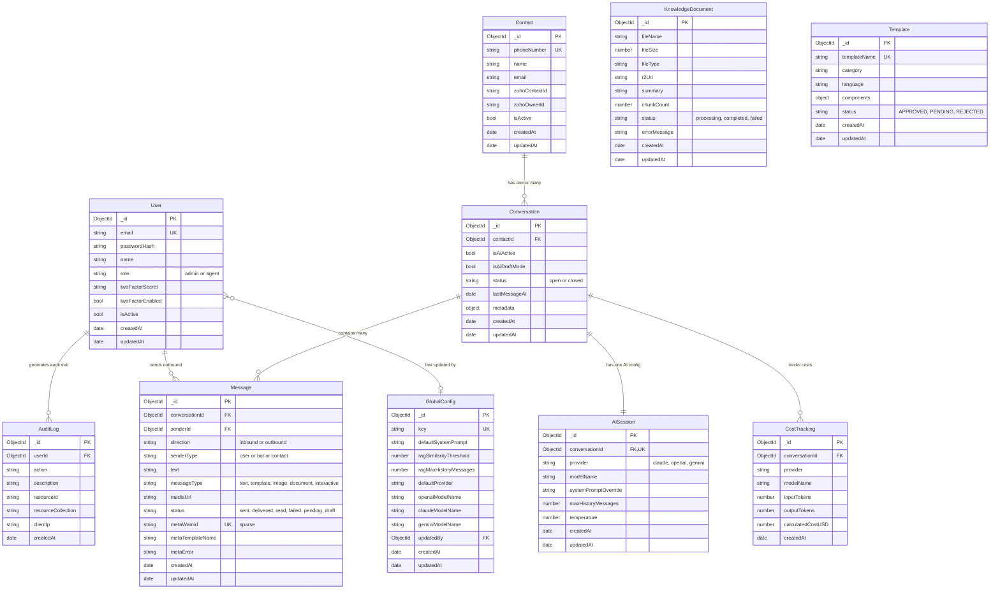

# Database Relationships Diagram

```mermaid
erDiagram
    User {
        ObjectId _id PK
        string email UK
        string passwordHash
        string name
        string role "admin or agent"
        string twoFactorSecret
        bool twoFactorEnabled
        bool isActive
        date createdAt
        date updatedAt
    }

    Contact {
        ObjectId _id PK
        string phoneNumber UK
        string name
        string email
        string zohoContactId
        string zohoOwnerId
        bool isActive
        date createdAt
        date updatedAt
    }

    Conversation {
        ObjectId _id PK
        ObjectId contactId FK
        bool isAiActive
        bool isAiDraftMode
        string status "open or closed"
        date lastMessageAt
        object metadata
        date createdAt
        date updatedAt
    }

    Message {
        ObjectId _id PK
        ObjectId conversationId FK
        ObjectId senderId FK
        string direction "inbound or outbound"
        string senderType "user or bot or contact"
        string text
        string messageType "text, template, image, document, interactive"
        string mediaUrl
        string status "sent, delivered, read, failed, pending, draft"
        string metaWamid UK "sparse"
        string metaTemplateName
        string metaError
        date createdAt
        date updatedAt
    }

    AISession {
        ObjectId _id PK
        ObjectId conversationId FK, UK
        string provider "claude, openai, gemini"
        string modelName
        string systemPromptOverride
        number maxHistoryMessages
        number temperature
        date createdAt
        date updatedAt
    }

    CostTracking {
        ObjectId _id PK
        ObjectId conversationId FK
        string provider
        string modelName
        number inputTokens
        number outputTokens
        number calculatedCostUSD
        date createdAt
    }

    AuditLog {
        ObjectId _id PK
        ObjectId userId FK
        string action
        string description
        string resourceId
        string resourceCollection
        string clientIp
        date createdAt
    }

    KnowledgeDocument {
        ObjectId _id PK
        string fileName
        number fileSize
        string fileType
        string r2Url
        string summary
        number chunkCount
        string status "processing, completed, failed"
        string errorMessage
        date createdAt
        date updatedAt
    }

    Template {
        ObjectId _id PK
        string templateName UK
        string category
        string language
        object components
        string status "APPROVED, PENDING, REJECTED"
        date createdAt
        date updatedAt
    }

    GlobalConfig {
        ObjectId _id PK
        string key UK
        string defaultSystemPrompt
        number ragSimilarityThreshold
        number ragMaxHistoryMessages
        string defaultProvider
        string openaiModelName
        string claudeModelName
        string geminiModelName
        ObjectId updatedBy FK
        date createdAt
        date updatedAt
    }

    Contact ||--o{ Conversation : "has one or many"
    Conversation ||--o{ Message : "contains many"
    User ||--o{ Message : "sends outbound"
    Conversation ||--|| AISession : "has one AI config"
    Conversation ||--o{ CostTracking : "tracks costs"
    User ||--o{ AuditLog : "generates audit trail"
    User }o--o| GlobalConfig : "last updated by"
```
