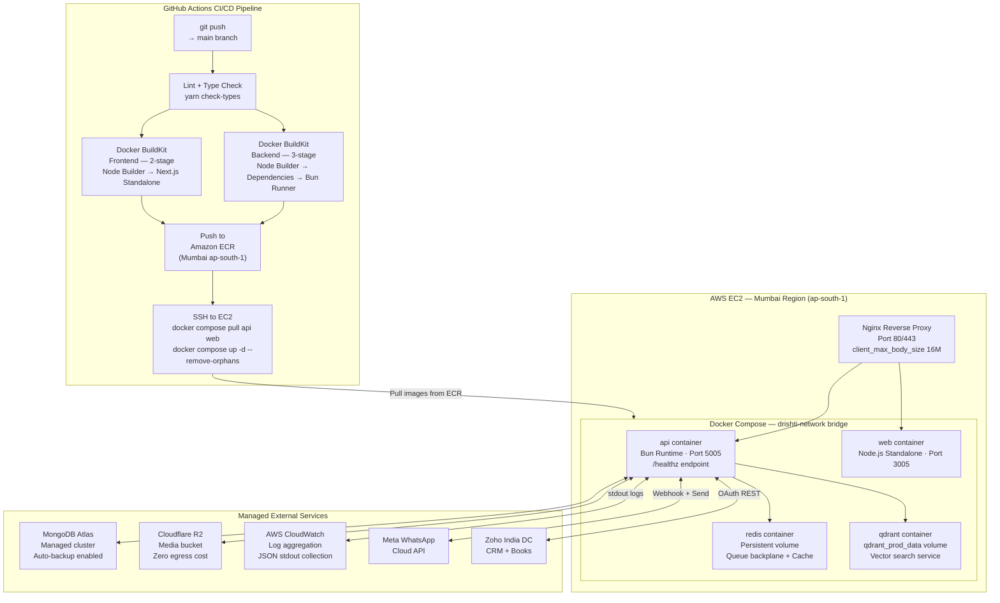

# Deployment Architecture Diagram

```mermaid
graph TB
    subgraph CICD["GitHub Actions CI/CD Pipeline"]
        direction LR
        PUSH["git push\n→ main branch"]
        LINT["Lint + Type Check\nyarn check-types"]
        BUILD_API["Docker BuildKit\nBackend — 3-stage\nNode Builder → Dependencies → Bun Runner"]
        BUILD_WEB["Docker BuildKit\nFrontend — 2-stage\nNode Builder → Next.js Standalone"]
        ECR["Push to\nAmazon ECR\n(Mumbai ap-south-1)"]
        SSH["SSH to EC2\ndocker compose pull api web\ndocker compose up -d --remove-orphans"]

        PUSH --> LINT --> BUILD_API & BUILD_WEB --> ECR --> SSH
    end

    subgraph AWS["AWS EC2 — Mumbai Region (ap-south-1)"]
        NGINX["Nginx Reverse Proxy\nPort 80/443\nclient_max_body_size 16M"]

        subgraph DOCKER["Docker Compose — drishti-network bridge"]
            API["api container\nBun Runtime · Port 5005\n/healthz endpoint"]
            WEB["web container\nNode.js Standalone · Port 3005"]
            REDIS_C["redis container\nPersistent volume\nQueue backplane + Cache"]
            QDRANT_C["qdrant container\nqdrant_prod_data volume\nVector search service"]
        end

        NGINX --> API & WEB
        API --> REDIS_C & QDRANT_C
    end

    subgraph MANAGED["Managed External Services"]
        ATLAS["MongoDB Atlas\nManaged cluster\nAuto-backup enabled"]
        CF_R2["Cloudflare R2\nMedia bucket\nZero egress cost"]
        CW["AWS CloudWatch\nLog aggregation\nJSON stdout collection"]
        META_EXT["Meta WhatsApp\nCloud API"]
        ZOHO_EXT["Zoho India DC\nCRM + Books"]
    end

    SSH -->|"Pull images from ECR"| DOCKER
    API <--> ATLAS
    API <--> CF_R2
    API <-->|"stdout logs"| CW
    API <-->|"Webhook + Send"| META_EXT
    API <-->|"OAuth REST"| ZOHO_EXT
```
