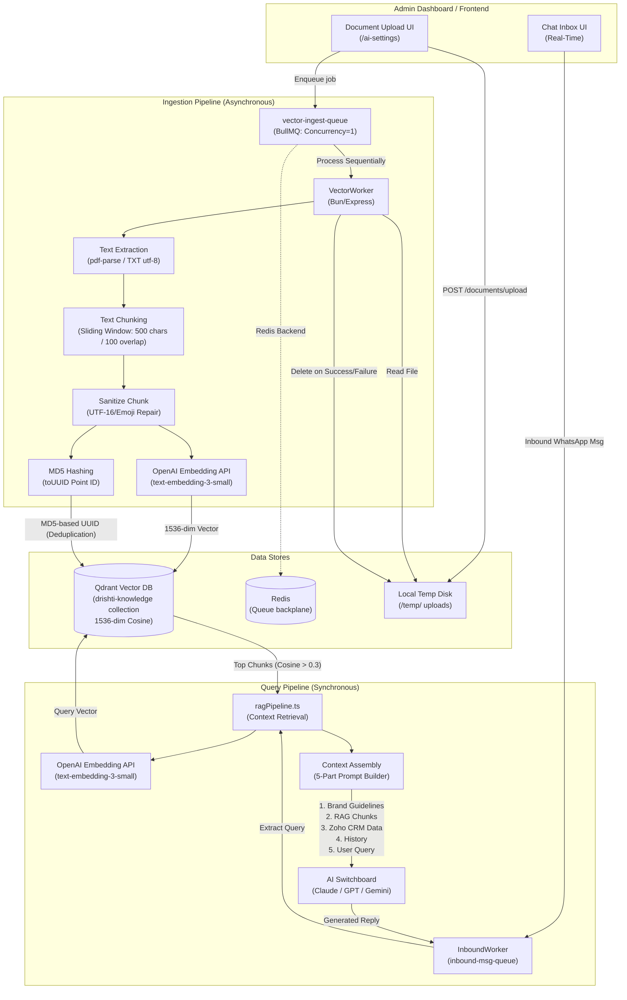

# RAG Ingestion & Query Pipeline Diagram

```mermaid
flowchart TB
    %% Definitions
    subgraph UI["Admin Dashboard / Frontend"]
        UPLOAD["Document Upload UI\n(/ai-settings)"]
        CHAT_UI["Chat Inbox UI\n(Real-Time)"]
    end

    subgraph Ingestion["Ingestion Pipeline (Asynchronous)"]
        VQ["vector-ingest-queue\n(BullMQ: Concurrency=1)"]
        VW["VectorWorker\n(Bun/Express)"]
        EXTRACT["Text Extraction\n(pdf-parse / TXT utf-8)"]
        CHUNK["Text Chunking\n(Sliding Window: 500 chars / 100 overlap)"]
        CLEAN["Sanitize Chunk\n(UTF-16/Emoji Repair)"]
        HASH["MD5 Hashing\n(toUUID Point ID)"]
        EMBED_INGEST["OpenAI Embedding API\n(text-embedding-3-small)"]
    end

    subgraph Query["Query Pipeline (Synchronous)"]
        IW["InboundWorker\n(inbound-msg-queue)"]
        RAG["ragPipeline.ts\n(Context Retrieval)"]
        EMBED_QUERY["OpenAI Embedding API\n(text-embedding-3-small)"]
        ASSEMBLE["Context Assembly\n(5-Part Prompt Builder)"]
        LLM["AI Switchboard\n(Claude / GPT / Gemini)"]
    end

    subgraph Storage["Data Stores"]
        QDRANT[("Qdrant Vector DB\n(drishti-knowledge collection\n1536-dim Cosine)")]
        REDIS[("Redis\n(Queue backplane)")]
        TEMP_DISK["Local Temp Disk\n(/temp/ uploads)"]
    end

    %% Ingestion Flow
    UPLOAD -->|"POST /documents/upload"| TEMP_DISK
    UPLOAD -->|"Enqueue job"| VQ
    VQ -.->|"Redis Backend"| REDIS
    VQ -->|"Process Sequentially"| VW
    VW -->|"Read File"| TEMP_DISK
    VW --> EXTRACT
    EXTRACT --> CHUNK
    CHUNK --> CLEAN
    CLEAN --> HASH
    CLEAN --> EMBED_INGEST
    EMBED_INGEST -->|"1536-dim Vector"| QDRANT
    HASH -->|"MD5-based UUID (Deduplication)"| QDRANT
    VW -->|"Delete on Success/Failure"| TEMP_DISK

    %% Query Flow
    CHAT_UI -->|"Inbound WhatsApp Msg"| IW
    IW -->|"Extract Query"| RAG
    RAG --> EMBED_QUERY
    EMBED_QUERY -->|"Query Vector"| QDRANT
    QDRANT -->|"Top Chunks (Cosine > 0.3)"| RAG
    RAG --> ASSEMBLE
    ASSEMBLE -->|"1. Brand Guidelines\n2. RAG Chunks\n3. Zoho CRM Data\n4. History\n5. User Query"| LLM
    LLM -->|"Generated Reply"| IW
```
