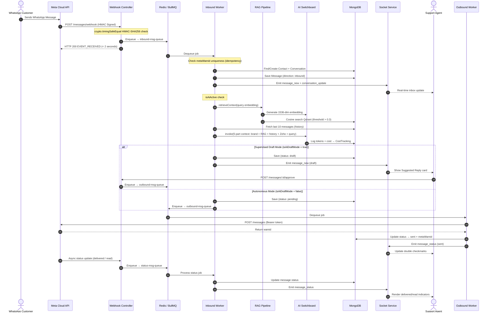

# Request Flow Diagram — Inbound Message Lifecycle

```mermaid
sequenceDiagram
    autonumber
    actor Customer as WhatsApp Customer
    participant Meta as Meta Cloud API
    participant WH as Webhook Controller
    participant Redis as Redis / BullMQ
    participant IW as Inbound Worker
    participant RAG as RAG Pipeline
    participant LLM as AI Switchboard
    participant DB as MongoDB
    participant Socket as Socket Service
    actor Agent as Support Agent
    participant OW as Outbound Worker

    Customer->>Meta: Sends WhatsApp Message
    Meta->>WH: POST /messages/webhook (HMAC Signed)
    Note over WH: crypto.timingSafeEqual HMAC-SHA256 check
    WH->>Redis: Enqueue → inbound-msg-queue
    WH-->>Meta: HTTP 200 EVENT_RECEIVED (< 2 seconds)

    Redis->>IW: Dequeue job
    Note over IW: Check metaWamid uniqueness (idempotency)
    IW->>DB: Find/Create Contact + Conversation
    IW->>DB: Save Message (direction: inbound)
    IW->>Socket: Emit message_new + conversation_update
    Socket-->>Agent: Real-time inbox update

    Note over IW: isAiActive check
    IW->>RAG: retrieveContext(query embedding)
    RAG->>LLM: Generate 1536-dim embedding
    RAG->>DB: Cosine search Qdrant (threshold > 0.3)
    IW->>DB: Fetch last 10 messages (history)
    IW->>LLM: invoke(5-part context: brand + RAG + history + Zoho + query)
    LLM->>DB: Log tokens + cost → CostTracking

    alt Supervised Draft Mode (isAiDraftMode = true)
        IW->>DB: Save (status: draft)
        IW->>Socket: Emit message_new (draft)
        Socket-->>Agent: Show Suggested Reply card
        Agent->>WH: POST /messages/:id/approve
        WH->>Redis: Enqueue → outbound-msg-queue
    else Autonomous Mode (isAiDraftMode = false)
        IW->>DB: Save (status: pending)
        IW->>Redis: Enqueue → outbound-msg-queue
    end

    Redis->>OW: Dequeue job
    OW->>Meta: POST /messages (Bearer token)
    Meta-->>OW: Return wamid
    OW->>DB: Update status → sent + metaWamid
    OW->>Socket: Emit message_status (sent)
    Socket-->>Agent: Update double checkmarks

    Meta->>WH: Async status update (delivered / read)
    WH->>Redis: Enqueue → status-msg-queue
    Redis->>IW: Process status job
    IW->>DB: Update message status
    IW->>Socket: Emit message_status
    Socket-->>Agent: Render delivered/read indicators
```
