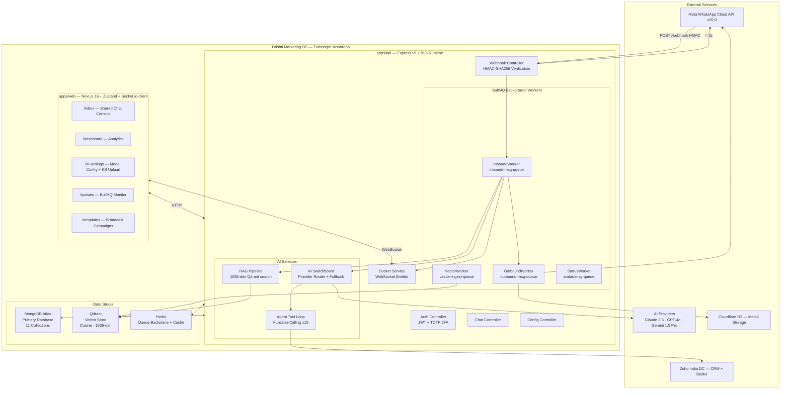

# System Architecture Diagram

```mermaid
graph TB
    subgraph External["External Services"]
        META["Meta WhatsApp Cloud API v20.0"]
        ZOHO["Zoho India DC — CRM + Books"]
        LLM["AI Providers\nClaude 3.5 · GPT-4o · Gemini 1.5 Pro"]
        R2["Cloudflare R2 — Media Storage"]
    end

    subgraph Monorepo["Drishti Marketing OS — Turborepo Monorepo"]
        subgraph FE["apps/web — Next.js 16 + Zustand + Socket.io-client"]
            INBOX_PAGE["/inbox — Shared Chat Console"]
            DASH_PAGE["/dashboard — Analytics"]
            AI_PAGE["/ai-settings — Model Config + KB Upload"]
            Q_PAGE["/queues — BullMQ Monitor"]
            T_PAGE["/templates — Broadcast Campaigns"]
        end

        subgraph BE["apps/api — Express v5 + Bun Runtime"]
            WH["Webhook Controller\nHMAC-SHA256 Verification"]
            AUTH_C["Auth Controller\nJWT + TOTP 2FA"]
            CHAT_C["Chat Controller"]
            CONFIG_C["Config Controller"]

            subgraph WORKERS["BullMQ Background Workers"]
                IW["InboundWorker\ninbound-msg-queue"]
                OW["OutboundWorker\noutbound-msg-queue"]
                VW["VectorWorker\nvector-ingest-queue"]
                SW["StatusWorker\nstatus-msg-queue"]
            end

            subgraph AI["AI Services"]
                RAG["RAG Pipeline\n1536-dim Qdrant search"]
                SWITCH["AI Switchboard\nProvider Router + Fallback"]
                TOOLS["Agent Tool Loop\nFunction-Calling x10"]
            end

            SOCK["Socket Service\nWebSocket Emitter"]
        end

        subgraph DS["Data Stores"]
            MONGO["MongoDB Atlas\nPrimary Database\n11 Collections"]
            QDRANT["Qdrant\nVector Store\nCosine · 1536-dim"]
            REDIS["Redis\nQueue Backplane + Cache"]
        end
    end

    META -->|"POST /webhook HMAC"| WH
    WH -->|"< 2s"| META
    WH --> IW
    IW --> RAG --> QDRANT
    IW --> SWITCH --> TOOLS --> ZOHO
    SWITCH --> LLM
    IW --> OW --> META
    IW --> SOCK
    VW --> QDRANT
    BE <--> MONGO
    BE <--> REDIS
    FE <-->|HTTP| BE
    FE <-->|WebSocket| SOCK
    OW --> R2
```
