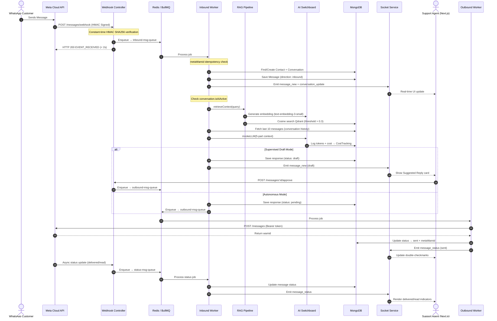
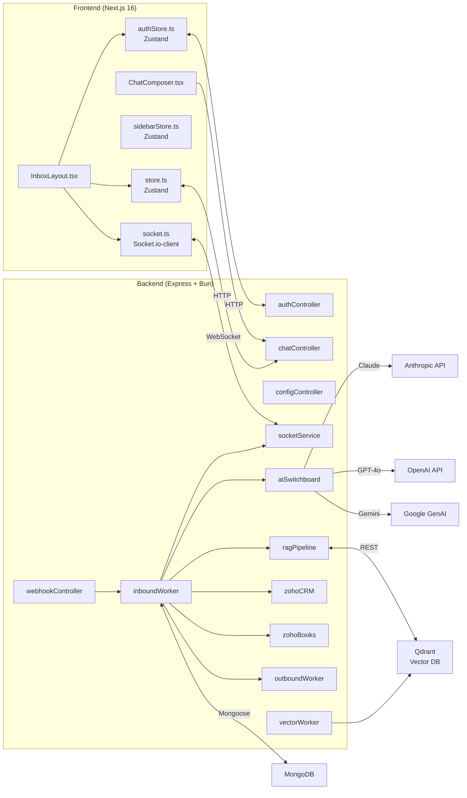
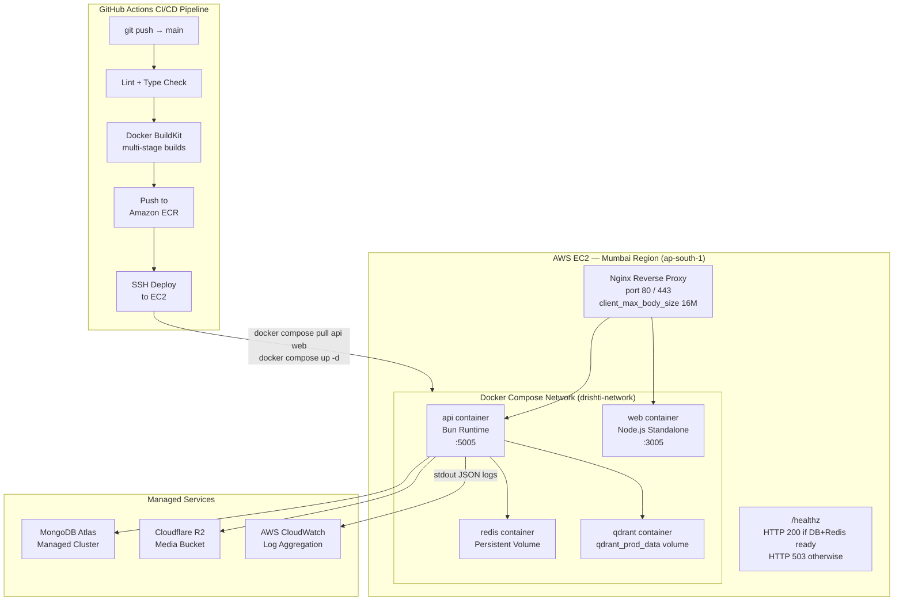
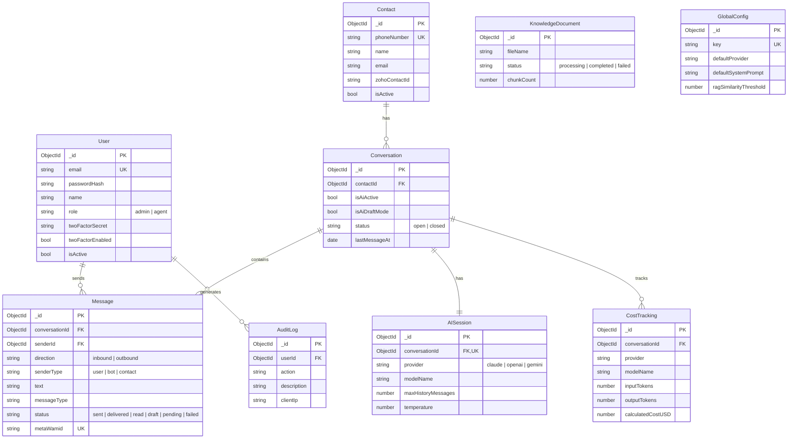
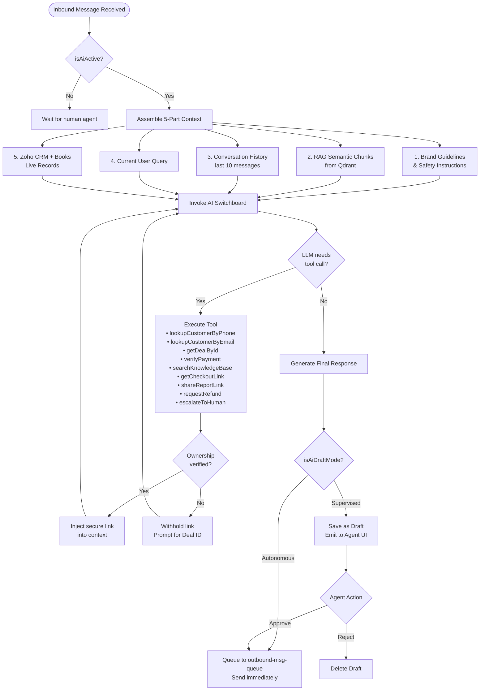

# System Architecture

> **Disclaimer**: This repository is a technical case study. The original implementation is proprietary and owned by the employer. No confidential source code, credentials, or sensitive business information is included.

---

## 1. High-Level System Architecture

The system is structured as a **Turborepo monorepo** containing two applications — a Next.js 16 web frontend and a Bun/Express API backend — backed by three data stores (MongoDB, Qdrant, Redis) and integrated with Meta's WhatsApp Cloud API and Zoho's India DC APIs.

```mermaid
graph TB
    subgraph External["External Services"]
        META["Meta WhatsApp\nCloud API v20.0"]
        ZOHO["Zoho India DC\nCRM + Books"]
        LLM["AI Providers\nClaude · GPT-4o · Gemini"]
        R2["Cloudflare R2\nMedia Storage"]
        ECR["Amazon ECR\nContainer Registry"]
    end

    subgraph Monorepo["Drishti Marketing OS — Turborepo Monorepo"]
        subgraph Frontend["apps/web — Next.js 16"]
            LOGIN["/login\nAuth + 2FA"]
            INBOX["/inbox\nShared Chat Console"]
            DASH["/dashboard\nAnalytics"]
            AISETTINGS["/ai-settings\nModel Config + KB Upload"]
            QUEUES["/queues\nBullMQ Monitor"]
            TEMPLATES["/templates\nBroadcast Campaigns"]
        end

        subgraph Backend["apps/api — Express + Bun"]
            WEBHOOK["Webhook Controller\nHMAC Verification"]
            AUTH["Auth Controller\nJWT + 2FA TOTP"]
            CHAT["Chat Controller\nInbox API"]
            CONFIG["Config Controller\nGlobal AI Settings"]
            MEDIA["Media Controller\n16MB Upload + R2 Presign"]
            ANALYTICS["Analytics Controller\nToken Cost Aggregation"]

            subgraph Queues["BullMQ Background Workers"]
                IQ["inbound-msg-queue\nInboundWorker"]
                OQ["outbound-msg-queue\nOutboundWorker"]
                VQ["vector-ingest-queue\nVectorWorker"]
                SQ["status-msg-queue\nStatusWorker"]
            end

            subgraph AILayer["AI Services"]
                RAG["RAG Pipeline\nQdrant Semantic Search"]
                SWITCH["AI Switchboard\nProvider Router"]
                TOOLS["Agent Tool Loop\nFunction-Calling"]
            end

            SOCKET["Socket Service\nWebSocket Emitter"]
        end

        subgraph DataStores["Data Stores"]
            MONGO["MongoDB Atlas\nPrimary Database"]
            QDRANT["Qdrant\nVector Store\n1536-dim Cosine"]
            REDIS["Redis\nQueue Backplane\n+ Cache"]
        end
    end

    %% Frontend ↔ Backend
    INBOX <-->|"HTTP + Cookie Auth"| CHAT
    INBOX <-->|"WebSocket / Socket.io"| SOCKET
    LOGIN -->|"POST /auth/login"| AUTH
    AISETTINGS -->|"POST /documents/upload"| VQ
    QUEUES -->|"GET /queues"| QUEUES
    TEMPLATES -->|"POST /templates/broadcast"| OQ

    %% Meta Webhook flow
    META -->|"POST /messages/webhook\nHMAC Signed"| WEBHOOK
    WEBHOOK -->|"Enqueue payload"| IQ
    WEBHOOK -->|"200 EVENT_RECEIVED < 2s"| META

    %% Inbound Worker
    IQ -->|"Process job"| RAG
    IQ -->|"Invoke LLM"| SWITCH
    SWITCH --> TOOLS
    TOOLS --> ZOHO
    IQ -->|"Emit events"| SOCKET
    IQ -->|"Enqueue reply"| OQ

    %% Outbound Worker
    OQ -->|"POST /messages"| META

    %% Vector Worker
    VQ -->|"Upsert 1536-dim vectors"| QDRANT

    %% Data store connections
    Backend <-->|"Mongoose ODM"| MONGO
    RAG <-->|"REST Client"| QDRANT
    Backend <-->|"ioredis"| REDIS

    %% External AI
    SWITCH -->|"Completions API"| LLM

    %% Media
    MEDIA -->|"Pre-signed PUT"| R2

    %% CI/CD
    ECR -->|"docker pull"| Backend
```

---

## 2. Request Flow — Inbound Message Lifecycle

Every inbound WhatsApp message traverses a 7-layer pipeline designed for sub-2s acknowledgement, idempotency, and grounded AI response generation.

---

## 3. Component Interaction Diagram

---

## 4. Deployment Architecture

---

## 5. Database Relationship Diagram

---

## 6. AI Agent Tool-Calling Loop

