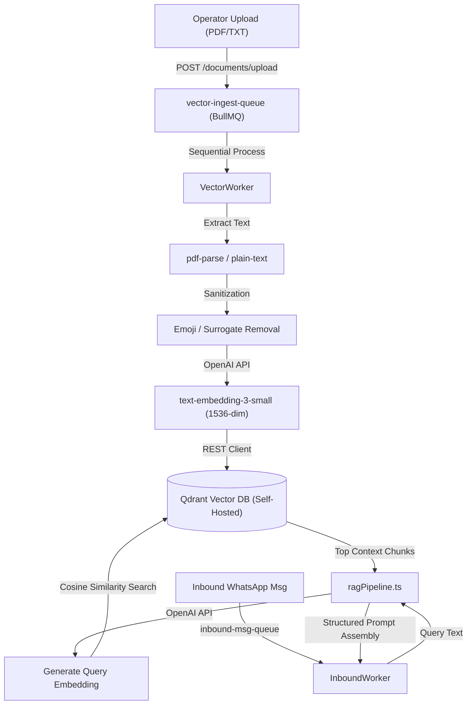

# RAG Ingestion & Query Pipeline

This document details the architecture, configuration, and implementation of the self-hosted Retrieval-Augmented Generation (RAG) system inside the **Drishti Marketing OS** codebase.

---

## 1. Pipeline Overview

The RAG pipeline provides the AI Auto-Responder with context grounded in proprietary business knowledge (e.g., astrological services guidelines, policies, and FAQs). It consists of two sub-pipelines:
1. **Ingestion Pipeline**: Asynchronously extracts text, sanitizes input, generates embeddings, and indexes chunks.
2. **Query Pipeline**: Translates inbound user queries into vector spaces to retrieve the top matching context chunks.



---

## 2. Ingestion Pipeline Details

Admin operators can upload knowledge base documents via the `/ai-settings` portal in the web frontend.

### Queue Backplane
* **Queue Name**: `vector-ingest-queue` (managed by BullMQ)
* **Concurrency**: `1` (sequential execution to avoid write/version conflicts on Qdrant points)
* **Retry Policy**: Standard retry with `removeOnFail: { age: 86400, count: 1000 }` to protect Redis memory.

### Step-by-Step Processing (`VectorWorker`)
1. **File Validation**: Rejects 0-byte or unsupported mime-types immediately.
2. **Text Extraction**:
   * **PDF**: Handled via `pdf-parse`.
   * **TXT**: Raw UTF-8 string conversion.
3. **Text Chunking (Sliding Window)**:
   * The raw extracted text is split into fragments using the character-based sliding window method in `DocumentParser.chunkText`.
   * **Normalization**: First, line breaks and extra spacing are normalized to single spaces.
   * **Sliding Window slicing**: Chunks are created using a character length of `500` and an overlap of `100` characters:
     ```typescript
     let start = 0;
     while (start < cleanedText.length) {
       const end = Math.min(start + chunkSize, cleanedText.length);
       const chunk = cleanedText.substring(start, end);
       chunks.push(chunk);
       start += chunkSize - overlap;
     }
     ```
4. **Pre-Embedding Sanitization**:
   * Each chunk undergoes sanitization (`sanitizeChunk`) to remove malformed Unicode sequences or repair broken UTF-16 surrogate pairs (e.g. split emojis) that can occur when splitting text at exact character boundaries.
   * This is critical to prevent `@qdrant/js-client-rest` REST client validation and upsert errors.
5. **MD5-Based Deduplication**:
   * The sanitized text chunk is hashed with MD5.
   * The resulting MD5 hex string is converted to a UUIDv4-compatible format (`toUUID()`) and used as the Qdrant Point ID.
   * This guarantees that re-uploading the same document results in overwriting (updating) instead of duplicating vectors.
6. **Embedding Generation**:
   * Sends the sanitized chunk to OpenAI's `text-embedding-3-small` API.
   * Returns a 1536-dimension float vector.
7. **Upsert to Vector Store**:
   * Point format:
     ```json
     {
       "id": "md5-derived-uuid",
       "vector": [1536 float values],
       "payload": {
         "text": "original raw text chunk",
         "filename": "guidelines.pdf",
         "uploadedAt": "timestamp"
       }
     }
     ```
8. **Differentiated File Cleanup**:
   * Temporarily uploaded files remain on the local disk (`/temp/`) during worker retry attempts.
   * Files are cleaned up/deleted **only** upon successful upsert or final failure limit hit.

---

## 3. Database Schema & Configurations

* **Vector Database**: Self-hosted Qdrant running in a local Docker container (configured via `docker-compose.prod.yml`).
* **Collection Name**: `drishti-knowledge`
* **Vector Dimension**: `1536`
* **Distance Metric**: `Cosine`
* **Similarity Threshold**: `0.3` (configurable in `GlobalConfig` database document).
  * Chunks matching below `0.3` score are discarded.
  * If no chunks exceed this threshold, the conversation is marked for human agent takeover.

---

## 4. Query Pipeline Details (`ragPipeline.ts`)

When a customer sends an inbound message:
1. **Trigger**: If `conversation.isAiActive` is true, the `InboundWorker` extracts the query.
2. **Vector Conversion**: The user's query is converted to a 1536-dimension vector using `text-embedding-3-small`.
3. **Similarity Search**: Queries Qdrant for the top `N` closest points using Cosine distance.
4. **Context Assembly**:
   * High-scoring chunks are retrieved and assembled into a structured context block.
   * This context block is appended to the 5-part prompt payload:
     1. Brand Voice Guidelines
     2. **RAG Semantic Chunks**
     3. Zoho CRM Customer Metadata
     4. Conversation History (last 10 messages)
     5. Latest User Query
5. **AI Switchboard Execution**: The prompt is processed by the designated provider (Claude, GPT, or Gemini) to generate the response.
