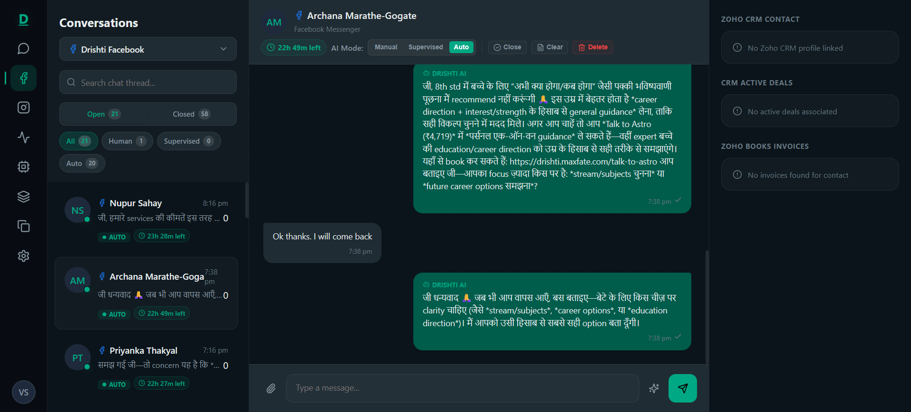
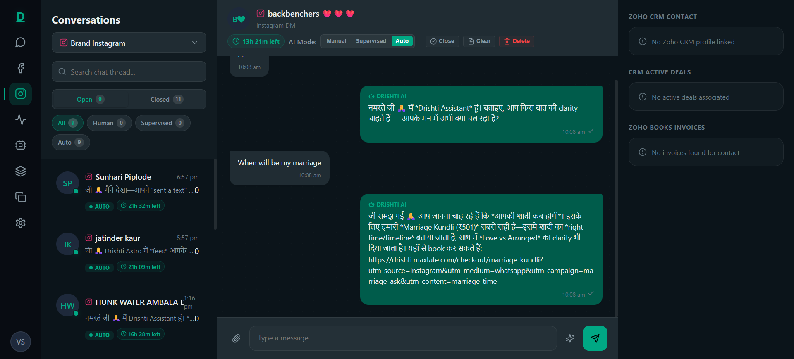
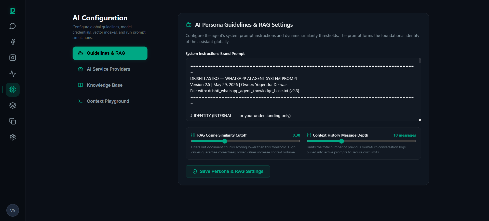
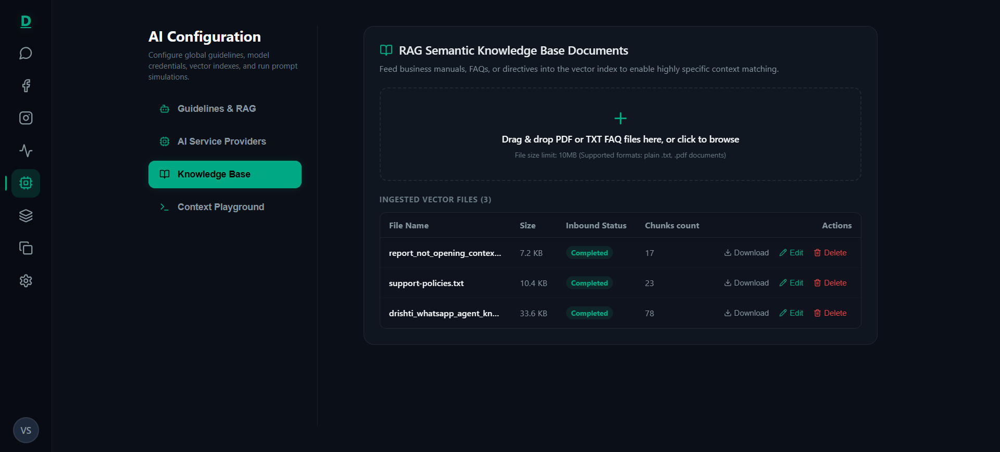
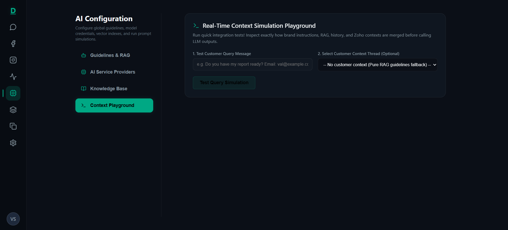
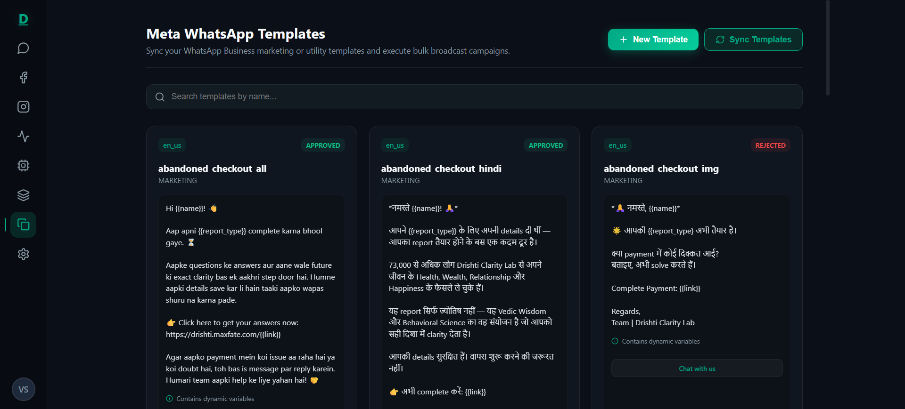
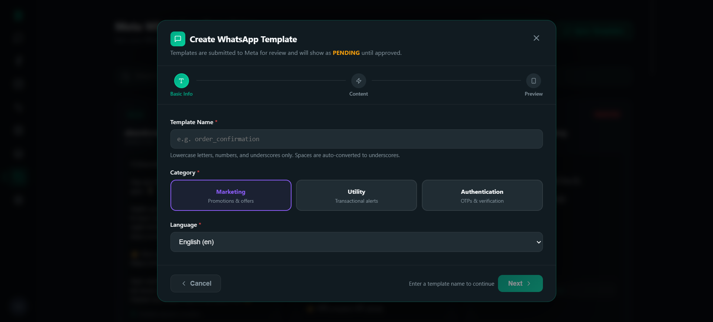
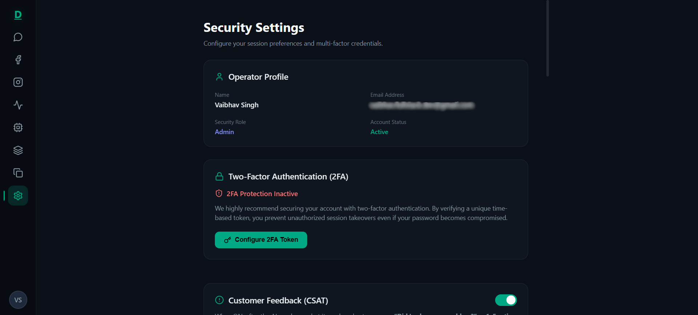

# Screenshots

> **Disclaimer**: This repository is a technical case study. The original implementation is proprietary and owned by the employer. No confidential source code, credentials, or sensitive business information is included. Screenshots have been reviewed for sensitive data before inclusion.

---

## 1. Shared Inbox — WhatsApp (AI Auto-Response + Zoho CRM Sidebar)

The 4-column inbox layout: navigation sidebar, conversation thread list with Open/Closed filters and AI mode badges, the active chat canvas, and the live Zoho CRM contact + deal sidebar. Shows the AI auto-response (labeled **DRISHTI AI**), the Manual/Supervised/Auto mode toggle, the 24h Meta reply window countdown timer, and CRM actions — **View/Share Report**, **Report Correction Link**, and **Request Refund**.

---

## 2. Shared Inbox — Facebook Messenger (Autonomous AI Mode)

The same 4-column inbox layout serving a **Facebook Messenger** channel. The **Auto** mode indicator is active — all replies are sent automatically by the AI. The Zoho CRM panel shows "No Zoho CRM profile linked" for this contact (no matching phone in CRM).

---

## 3. Shared Inbox — Instagram DM (Autonomous AI Mode)

The inbox serving an **Instagram DM** channel with all 9 conversations running in full **Auto** mode. Demonstrates the multi-channel architecture — the same inbox engine handles WhatsApp, Facebook Messenger, and Instagram simultaneously.

---

## 4. AI Configuration — Guidelines & RAG Settings

The **AI Configuration** page → **Guidelines & RAG** tab. Shows the system brand prompt editor, the **RAG Cosine Similarity Cutoff** slider (set to 0.30), and the **Context History Message Depth** slider (set to 10 messages). All settings are persisted to `GlobalConfig` in MongoDB and apply to all AI sessions globally.

---

## 5. AI Configuration — AI Service Providers & Routing

The **AI Service Providers** tab. Shows the multi-provider panel with **OpenAI (GPT Models)** currently set as the **Active Override** (model: `gpt-5.4-nano`), with per-million-token input/output pricing configured. **Anthropic Claude** and **Google Gemini** are shown as System Default (.env) — available for override. Demonstrates the dynamic provider routing system.

---

## 6. AI Configuration — RAG Knowledge Base Documents

The **Knowledge Base** tab showing the drag-and-drop PDF/TXT uploader and the ingested vector files table. Three documents are shown with **Completed** status and their chunk counts (17, 23, and 78 chunks). Each chunk is embedded as a 1536-dim vector in the self-hosted Qdrant instance.

---

## 7. AI Configuration — Real-Time Context Simulation Playground

The **Context Playground** tab — a testing tool that lets admins simulate exactly how brand instructions, RAG chunks, conversation history, and Zoho context are merged before calling the LLM. Used to validate prompt assembly without sending live messages.

---

## 8. Queue & Infrastructure Manager

The **BullMQ Queue Monitor** showing all 4 background queues: `inbound-msg-queue`, `outbound-msg-queue`, `status-msg-queue`, and `vector-ingest-queue`. Each queue shows real-time **Active**, **Waiting**, **Delayed**, and **Failed** job counts. Admins can expand each queue to retry or delete individual failed jobs.

---

## 9. Meta WhatsApp Templates — Broadcast Console

The **Templates** page showing synced Meta-approved WhatsApp templates in a card grid. Templates show their approval status (APPROVED / REJECTED), language, category (MARKETING), and body content with `{{variable}}` placeholders. Admins can sync from Meta Graph API and launch bulk broadcast campaigns from this view.

---

## 10. Create WhatsApp Template — Multi-Step Modal

The **Create Template** modal with a 3-step flow (Basic Info → Content → Preview). Supports template categories: **Marketing**, **Utility**, and **Authentication**, with language selection. Templates are submitted to Meta for review via the Graph API.

---

## 11. Security Settings — Operator Profile & 2FA

The **Security Settings** page showing the operator profile card (name, email, role, account status) and the **Two-Factor Authentication (2FA)** setup panel. Admins can configure a TOTP token via Google Authenticator using the QR code enrollment flow powered by `otplib`.

---

## 12. Token Cost Analytics Dashboard

The **Token Cost Analytics** dashboard showing 30-day AI spend metrics. Total calculated cost, per-provider breakdown (Claude, OpenAI, Gemini), a **Daily Cost Trend** area chart, and a **Token Volume Share** donut chart broken down by exact model name and cost. Real data: **24.5M input tokens / 243K output tokens** processed over 30 days.

